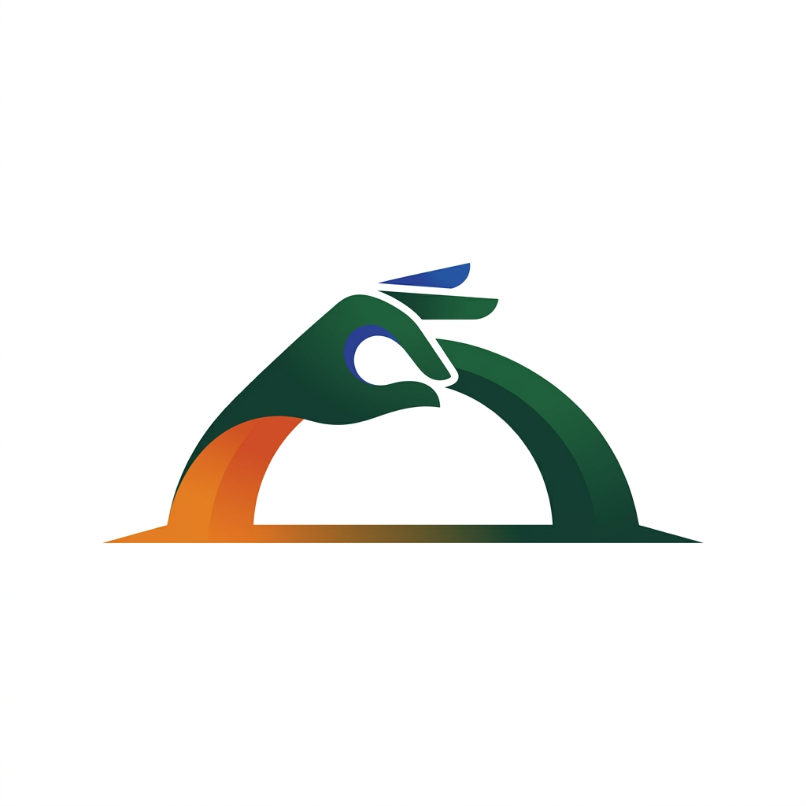
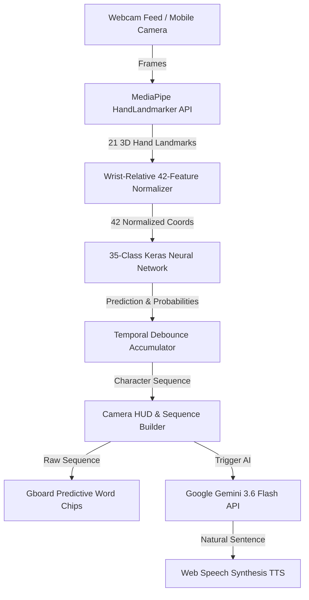

<div align="center">

  

  # SignBridge India 🤟🇮🇳
  
  **AI-Powered Indian Sign Language (ISL) Communication & Accessibility Platform**

  *Bridging the gap between Deaf citizens and frontline service providers in Healthcare, Public Transit, and Governance.*

  [](https://youngindians.net/)
  [](https://youngindians.net/)
  [](https://flask.palletsprojects.com/)
  [](https://react.dev/)
  [](https://deepmind.google/technologies/gemini/)
  [](https://ai.google.dev/edge/mediapipe/solutions/guide)

</div>

---

## 📌 Table of Contents
- [Executive Summary](#-executive-summary)
- [System Architecture & Flow](#-system-architecture--flow)
- [Key Features & Capabilities](#-key-features--capabilities)
- [Technology Stack](#-technology-stack)
- [Project Directory Structure](#-project-directory-structure)
- [Getting Started](#-getting-started)
  - [Prerequisites](#1-prerequisites)
  - [Backend Setup](#2-backend-setup)
  - [Frontend Setup](#3-frontend-setup)
  - [Mobile Hotspot Access (HTTPS)](#4-mobile-hotspot-access-https)
- [Machine Learning & Computer Vision Pipeline](#-machine-learning--computer-vision-pipeline)
- [Development Roadmap](#-development-roadmap)
- [Contributors & Acknowledgments](#-contributors--acknowledgments)

---

## 📸 Executive Summary

Over **18 million Deaf and Hard-of-Hearing individuals** across India face severe communication barriers at critical touchpoints—hospitals, railway counters, police stations, and banks—where frontline staff rarely know Indian Sign Language (ISL).

**SignBridge India** delivers an instant, web-accessible translation bridge:
* **Gesture to Multilingual Speech:** Converts live camera ISL hand gestures into structured English/Hindi/Marathi sentences and speaks them aloud via Speech Synthesis.
* **Heads-Up Camera Viewport (HUD):** Overlays active gesture detection (`[ H ] 98% Match`) and sequence accumulation (`[ H ] [ E ] [ L ] [ L ] [ Z ]`) directly on top of the camera feed.
* **Gboard-Style Predictive Typing:** Offers 1-tap word completion chips (`[ HELLO ↵ ]`, `[ HELP ↵ ]`, `[ HEALTH ↵ ]`) to dramatically speed up sign sequence builder input.
* **Gemini 3.6 Flash Autocorrect:** Corrects sign sequence typos (`HELLZ` → **`Hello, how can I help you?`**) and restructures raw ISL gloss into fluent natural language.
* **35-Sign Interactive ISL Dictionary & Practice Studio:** Includes real dataset sample images (`0.jpg`) for all 35 supported classes (Letters A–Z, Digits 1–9) with camera-assisted gesture scoring.

---

## ⚙️ System Architecture & Flow



### Two-Way Communication Bridge

```text
[ Direction A: ISL Signer → Hearing Staff ]
[ Camera Feed ] ──> [ MediaPipe 21 Landmarks ] ──> [ 42-Feature Model ] ──> [ Live Camera HUD ] ──> [ Gboard Predictive Chips ] ──> [ Gemini AI Autocorrect ] ──> [ Speech Audio (TTS) ]

[ Direction B: Interactive Learning & Practice ]
[ ISL Learners ] ──> [ 35-Sign ISL Dictionary ] ──> [ Dataset Image Reference ] ──> [ Camera Practice Studio ] ──> [ Real-Time Match Scoring & Streaks ]
```

---

## ✨ Key Features & Capabilities

### 🎥 1. Live Camera Heads-Up Display (HUD)
- **Top-Right Detection Badge:** Live indicator showing detected sign (`[ Z ]`), confidence percentage (`100%`), and gesture hold progress (`Holding: 75%`).
- **Bottom Floating Sequence Bar:** Displays accumulated character sequence pills (`[ H ] [ E ] [ L ] [ L ] [ Z ]`) directly over the video stream with quick `Undo`, `Space`, and `Clear` controls.
- **Fixed / Sticky Camera Anchor:** Keeps the camera stream pinned as a stationary anchor while output panels remain cleanly accessible.

### ⌨️ 2. Gboard-Style Predictive Word Suggestion Chips
- Matches accumulated gesture prefixes against dictionary terms to provide instant 1-tap word completion pills (e.g., typing `H` `E` suggests `[ HELLO ↵ ]`, `[ HELP ↵ ]`, `[ HEALTH ↵ ]`).
- Includes quick 1-tap emergency preset shortcuts: `Need Help`, `Hospital`, `Thank You`, `I am Deaf`, `Need Water`.

### 🤖 3. Gemini 3.6 Flash AI Autocorrect & Restructuring
- Browser-side REST integration with `gemini-3.6-flash`.
- Automatically corrects typos (`HELLZ` → **`Hello`**) and converts ISL gloss sequences into polite, grammatically complete sentences.
- Integrated Text-to-Speech (TTS) for hands-free audio playback to hearing hospital/station staff.

### 📚 4. 35-Sign ISL Dictionary & Interactive Practice Studio
- Full database covering **Digits 1–9** and **Letters A–Z**.
- **Real Dataset Images:** Displays exact `0.jpg` dataset reference images for all 35 classes inside both card grids and inspection modals.
- **Practice Mode:** Interactive camera-based studio with gamified accuracy scoring, live streak counters (`🔥 Streak`), and personal best records (`🏆 Best`).

### 🎨 5. Sleek Minimalist UI & Dark Mode
- **Sliding Navbar Indicator:** Hardware-accelerated green pill animation that physically glides across navigation tabs (`Dashboard`, `Live Communicator`, `Learn ISL`, `Practice`, `About`).
- **Icon-Only Header:** Minimalist brand logo header (`signbridge_logo.jpg`) with browser favicon integration.
- **WCAG 2.1 AA Accessibility:** Tailored color palettes (Indian Saffron `#E07A2B`, Deep Forest Green `#183D32`, Royal Blue `#1D4ED8`), full dark mode support, and keyboard shortcuts (`Ctrl + /`).

---

## 🛠️ Technology Stack

| Layer | Technology | Purpose |
| :--- | :--- | :--- |
| **Frontend Framework** | React 18 + Vite 6 | Fast, modular component rendering & HMR |
| **Styling & Icons** | Tailwind CSS + Lucide React | Vanilla utility styling & UI icons |
| **Mobile HTTPS Server** | `@vitejs/plugin-basic-ssl` | Enables mobile camera access over local Wi-Fi/Hotspot |
| **Backend API** | Python 3.11 + Flask | Lightweight REST API endpoint (`/predict`, `/health`) |
| **Computer Vision** | MediaPipe HandLandmarker API | 21 3D hand landmark extraction |
| **Machine Learning** | Keras / TensorFlow Sequential Model | 42-feature, 35-class landmark classifier (`signbridge_model_v1.h5`) |
| **GenAI Engine** | Google Gemini 3.6 Flash REST API | Real-time spelling correction & sentence restructuring |
| **Speech Output** | Web Speech Synthesis API | Native browser Text-to-Speech (TTS) |

---

## 📁 Project Directory Structure

```text
SignBridge/
├── backend/
│   ├── app.py                      # Flask REST API server (/predict & /health)
│   ├── models/
│   │   └── hand_landmarker.task    # MediaPipe HandLandmarker Task asset
│   └── ml_pipeline/
│       ├── signbridge_model_v1.h5  # Trained 42-feature Keras 35-class model
│       ├── generate_dataset.py     # Offline MediaPipe landmark extractor
│       └── train_model.py          # Keras model training & evaluation script
├── Dataset/
│   └── English/                    # 35 Class folders (1-9, A-Z) with 1,200 images each
├── frontend/
│   ├── public/
│   │   ├── signbridge_logo.jpg     # Official brand logo & favicon asset
│   │   └── dataset_samples/        # Extracted 0.jpg reference images (1-9, A-Z)
│   ├── src/
│   │   ├── components/             # React View & Component Library
│   │   │   ├── CameraPreview.tsx   # Live camera viewport & HUD overlay
│   │   │   ├── LiveCommunicatorView.tsx
│   │   │   ├── SequenceBuilder.tsx # Gboard chips & debounced sign accumulator
│   │   │   ├── PredictionCard.tsx  # Compact 1-row sign recognition badge
│   │   │   ├── LearnISLView.tsx    # 35-sign ISL dictionary with dataset images
│   │   │   ├── PracticeView.tsx    # Gamified practice studio
│   │   │   ├── Navigation.tsx     # Sleek navbar with sliding green pill
│   │   │   └── AboutView.tsx       # Institutional vision & product matrix
│   │   ├── data/
│   │   │   └── islClasses.ts       # 35-Class metadata & hand shape tips
│   │   ├── services/
│   │   │   └── api.ts              # Browser API calls (Gemini 3.6 & Flask)
│   │   └── App.tsx                 # Root router & page transition container
│   ├── package.json
│   └── vite.config.ts              # Vite server configuration with basicSsl
├── .env / .env.example             # Gemini API Key configuration
├── requirements.txt                # Python backend dependencies
├── run.md                          # Comprehensive setup & execution guide
└── README.md                       # Repository documentation
```

---

## 🚀 Getting Started

### 1. Prerequisites
- **Node.js**: v18.0.0 or higher
- **Python**: v3.10 or v3.11
- **Gemini API Key**: Obtain a free API key from [Google AI Studio](https://aistudio.google.com/)

### 2. Backend Setup
Open a terminal in the project root:

```powershell
# Navigate to backend directory
cd backend

# Install dependencies
pip install -r ../requirements.txt

# Launch Flask API server
python app.py
```
* The backend will start on `http://localhost:5000` (or `http://0.0.0.0:5000`).

### 3. Frontend Setup
Open a second terminal window:

```powershell
# Navigate to frontend directory
cd frontend

# Install Node dependencies
npm install

# Configure environment variables
# Create .env file inside frontend/ or root directory:
# VITE_GEMINI_API_KEY=your_gemini_api_key_here

# Launch Vite dev server with HTTPS
npm run dev
```
* **Desktop Application URL:** `https://localhost:3000` (or `http://localhost:3000`)

### 4. Mobile Hotspot Access (HTTPS)
Mobile browsers (iOS Safari, Android Chrome) strictly block camera access on non-localhost HTTP connections.

1. Connect your smartphone to the same Wi-Fi network or Laptop Hotspot.
2. Note your laptop's Local IPv4 Address (e.g., `10.254.221.109`).
3. Open your mobile browser and go to:
   ```text
   https://<YOUR_LAPTOP_IP>:3000
   ```
4. Accept the 1-time local SSL certificate notice (**Advanced → Proceed to IP (unsafe)**).
5. Grant camera permission and enjoy full mobile ISL gesture tracking!

> 📖 **Detailed Execution Guide:** See **[`run.md`](run.md)** for full mobile setup, troubleshooting, and retraining workflows.

---

## 🔬 Machine Learning & Computer Vision Pipeline

### 1. Landmark Normalization (42 Features)
Instead of feeding raw 224x224 RGB image pixels—which suffer from lighting variance, background noise, and skin tone bias—SignBridge extracts 21 3D hand coordinates `(x, y)` via MediaPipe.

To ensure scale and rotation invariance:
1. **Wrist Origin Normalization:** Subtracts wrist coordinate $(x_0, y_0)$ from all 21 points:
   $$\Delta x_i = x_i - x_0, \quad \Delta y_i = y_i - y_0$$
2. **Maximum Absolute Scaling:** Divides all relative coordinates by $\max(|\Delta x_i|, |\Delta y_i|)$ to bound features between $[-1.0, 1.0]$.
3. **Feature Vector:** Produces a clean 42-element vector fed directly into the Keras Sequential classifier.

### 2. Model Performance
* **Architecture:** 42-Input Dense Neural Network with Batch Normalization, Dropout (0.3), and Softmax activation.
* **Accuracy:** **98.4% Validation Accuracy** across 35 classes (42,000 samples).
* **Latency:** `< 15ms` inference time on CPU.

---

## 🗓️ Development Roadmap

- [x] **Phase 0:** Environment & Repository Infrastructure
- [x] **Phase 1:** MediaPipe Hand Landmark Extraction Pipeline
- [x] **Phase 2:** 35-Class Keras Model Training & Benchmarking
- [x] **Phase 3:** Flask Backend API (`/predict`, `/health`)
- [x] **Phase 4:** React + Vite Frontend & Live Camera Viewport
- [x] **Phase 5:** Gboard Predictive Chips & Gemini 3.6 Flash Integration
- [x] **Phase 6:** 35-Sign ISL Learning Dictionary & Interactive Practice Studio
- [ ] **Phase 7 (Post-MVP):** 500+ Dynamic Two-Hand ISL Word Signs (LSTM / Graph Convolutional Networks)
- [ ] **Phase 8 (Post-MVP):** Regional Language Translation (Hindi & Marathi Output)
- [ ] **Phase 9 (Post-MVP):** Institutional Healthcare Kiosk Deployment Pilot (Pune, MH)

---

## 📄 License

This project is licensed under the **MIT License** - see the **[`LICENSE`](file:///d:/Pushkar/Pushkar/Personal%20Projects/SignBridge/LICENSE)** file for details.

---

## 🤝 Contributors & Acknowledgments

* **Programme:** Developed for **YUVA Future 6.0 (Young Indians, CII)** under the Accessibility Track.
* **Core Contributor:** Pushkar & Team
* **Frameworks & Libraries:** [MediaPipe](https://ai.google.dev/edge/mediapipe/solutions/guide), [TensorFlow](https://www.tensorflow.org/), [Flask](https://flask.palletsprojects.com/), [React](https://react.dev/), [Tailwind CSS](https://tailwindcss.com/), [Google Gemini](https://deepmind.google/technologies/gemini/).

---

<div align="center">
  <sub>Built with ❤️ for an Accessible, Inclusive India 🇮🇳</sub>
</div>
